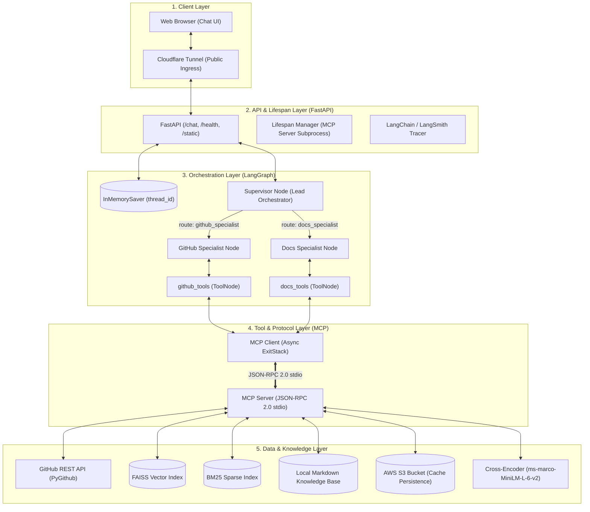
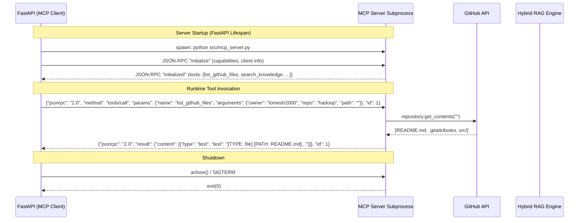
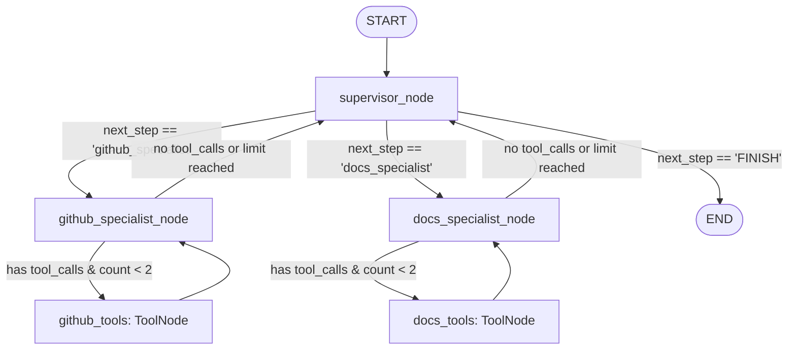
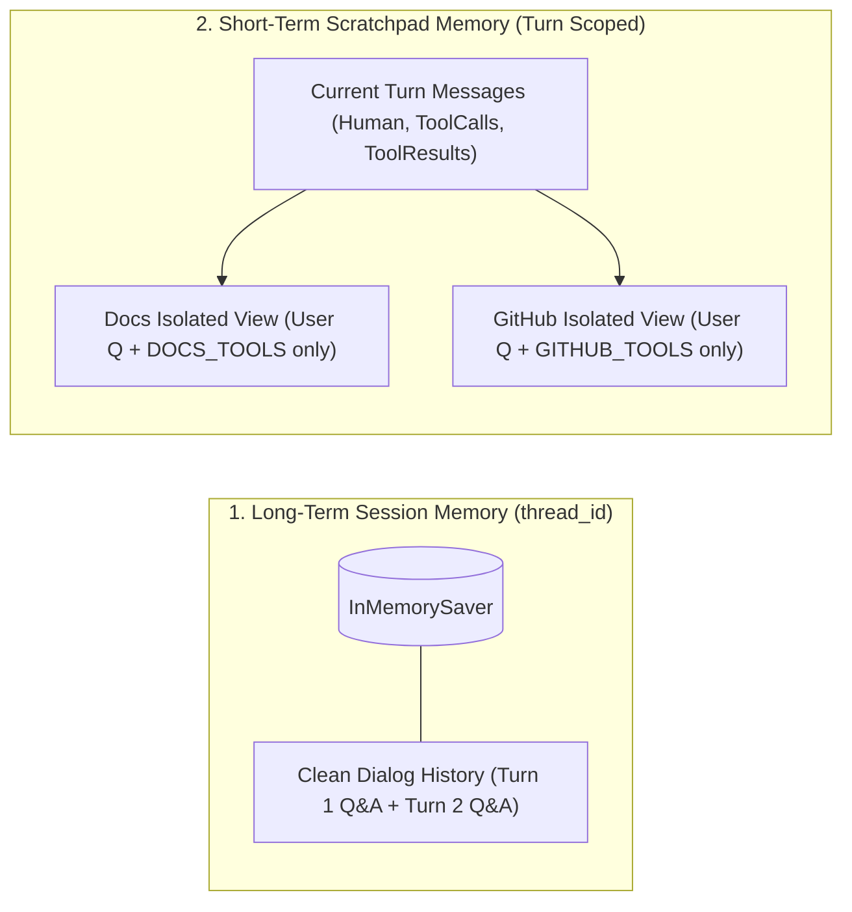
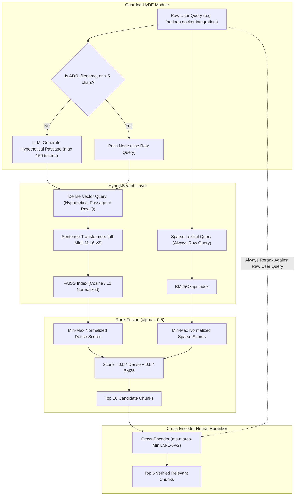

# Engineering Knowledge Agent: Comprehensive Architectural Evolution & Technical Specification

> **Document Version:** 3.0.0  
> **Last Updated:** October 2026  
> **Project Repository:** `Lomesh-AI/sand`  
> **Target Environment:** Ubuntu EC2 (Production) / Local Development  
> **Core Stack:** LangGraph, FastAPI, MCP (Model Context Protocol), Groq (`openai/gpt-oss-20b`), FAISS, BM25, Sentence-Transformers, PyGithub  

---

## Table of Contents
1. [Executive Summary & Problem Statement](#1-executive-summary--problem-statement)
2. [Architectural Evolution (Before vs. Middle vs. Latest)](#2-architectural-evolution-before-vs-middle-vs-latest)
3. [Current System Architecture](#3-current-system-architecture)
4. [Model Context Protocol (MCP): Client, Server & Protocols](#4-model-context-protocol-mcp-client-server--protocols)
5. [State Management & Graph Topology (LangGraph)](#5-state-management--graph-topology-langgraph)
6. [Memory Architecture & The Role of `thread_id`](#6-memory-architecture--the-role-of-thread_id)
7. [The Guarded Hybrid RAG Engine (HyDE + FAISS + BM25 + Reranker)](#7-the-guarded-hybrid-rag-engine-hyde--faiss--bm25--reranker)
8. [Critical Engineering Challenges Encountered & Their Solutions](#8-critical-engineering-challenges-encountered--their-solutions)
9. [API Specification, Payloads & Streaming Protocol](#9-api-specification-payloads--streaming-protocol)
10. [Security, Authentication & Production Deployment](#10-security-authentication--production-deployment)

---

## 1. Executive Summary & Problem Statement

### 1.1 The Core Problem
Modern software engineering teams suffer from fragmented knowledge spread across two fundamentally different domains:
1. **Static Architectural Knowledge:** Architecture Decision Records (ADRs), deployment runbooks, security policies, system design blueprints, and OpenAPI specifications stored as markdown documents in git repositories.
2. **Dynamic Codebase & Operational State:** Live GitHub repositories, pull requests, open issues, branch comparisons, commit histories, directory structures, and source code files.

When engineers ask complex questions—such as *"Check files in lomesh2000/hadoop and find out how we can integrate Hadoop with Docker according to our architectural guidelines"*—traditional systems fail:
- **Standard RAG (Retrieval-Augmented Generation)** fails because it cannot inspect live GitHub repositories, directory trees, or dynamic PR diffs.
- **Standalone Codebase Agents** fail because they lack access to internal organizational architecture decisions, runbooks, and security constraints.
- **Single-Prompt LLMs** hallucinate unverified code, fabricate URLs, invent non-existent files, and hit context window boundaries.

### 1.2 How We Solve It
We engineered an enterprise-grade, multi-agent orchestrator powered by **LangGraph** and the **Model Context Protocol (MCP)** that:
- Deconstructs compound engineering requests into targeted sub-tasks.
- Routes codebase queries to a specialized **GitHub & Codebase Specialist** that interacts with the live GitHub API via MCP tools.
- Routes architecture and infrastructure queries to a specialized **Documentation Specialist** backed by a Guarded Hybrid RAG engine (HyDE + FAISS dense search + BM25 sparse search + Cross-Encoder reranking).
- Employs a **Lead Orchestrator (Supervisor)** to coordinate multi-agent handoffs, enforce domain isolation, synthesize verified findings, and present clear, grounded answers without parametric hallucination.

---

## 2. Architectural Evolution (Before vs. Middle vs. Latest)

The architecture of this project underwent three major phases of evolution:

```mermaid
flowchart TD
    subgraph Phase1["Phase 1: Naive Monolith"]
        P1_User["User Query"] --> P1_Agent["Single Monolithic Agent"]
        P1_Agent --> P1_Tools["Direct Tool Pool (All Tools Mixed)"]
        P1_Tools --> P1_Out["Direct LLM Answer (Frequent Hallucinations)"]
    end

    subgraph Phase2["Phase 2: Fragile Multi-Agent & Exception Routing"]
        P2_User["User Query"] --> P2_Sup["Supervisor (Keyword String Matching)"]
        P2_Sup --> P2_Spec["Specialists (Tools Stripped on Turn 2)"]
        P2_Spec --> P2_Err["Groq 400 Errors / Context Bleed / Loop Traps"]
        P2_Err --> P2_Hacks["try/except String Parsing Hacks"]
    end

    subgraph Phase3["Phase 3: Grounded Multi-Agent + MCP + Isolated Scratchpads"]
        P3_User["User Query"] --> P3_Sup["Supervisor (Schema-Bound Router)"]
        P3_Sup --> P3_GH["GitHub Specialist (Isolated Scratchpad)"]
        P3_GH <--> P3_MCP1["MCP GitHub Tools"]
        P3_GH --> P3_Docs["Docs Specialist (Isolated Scratchpad)"]
        P3_Docs <--> P3_MCP2["Guarded HyDE + Hybrid RAG"]
        P3_Docs --> P3_Synth["Supervisor Synthesis (Sanitized Context, Zero Tools)"]
        P3_Synth --> P3_Out["100% Grounded Answer"]
    end
```



### Comparative Evolution Matrix

| Architectural Dimension | Phase 1: Before (Monolith) | Phase 2: Middle (Fragile Multi-Agent) | Phase 3: Latest (Grounded Multi-Agent) |
|---|---|---|---|
| **Agent Architecture** | Single monolithic ReAct agent binding all tools simultaneously. | Supervisor + 2 Specialists, but with ad-hoc tool stripping. | Strict Supervisor-Specialist ReAct pattern with clean conditional edges. |
| **Routing Mechanism** | None (LLM picked from 8+ tools at once). | Keyword substrings (`any(k in user_msg)`) & exception string parsing. | Structured tool-calling routing with fallback keywords & sequential multi-agent chaining. |
| **Tool Execution** | In-process Python functions coupled to the agent runtime. | Direct in-process MCP client calls without lifecycle management. | Fully decoupled MCP Client $\leftrightarrow$ Subprocess Server over JSON-RPC 2.0 stdio. |
| **RAG Pipeline** | Basic semantic search using raw cosine similarity. | FAISS + BM25 hybrid search, but queries polluted with usernames/repo names. | Guarded HyDE (Hypothetical Document Embeddings) + Hybrid Search + Cross-Encoder Reranking + S3 sync. |
| **Message History** | Entire message list passed to every call, overflowing context. | Turn messages shared across all specialists, causing context bleed. | **Specialist Scratchpad Isolation**: Each specialist only sees its own tools + 1-line clean context notes. |
| **Synthesis Safety** | Raw LLM output with no grounding checks. | Raw `[PATH: ...]` tool outputs injected into bare LLM, causing 400 errors. | **Sanitized Synthesis Context**: Machine tokens stripped to markdown bullets; strict negative prompt constraints. |
| **Streaming & API** | Synchronous REST endpoint blocking until completion. | Basic streaming, but crashed on multi-agent status transitions. | Full NDJSON async event streaming (`/chat`) via FastAPI, Cloudflare tunnel, and LangSmith tracing. |

---

## 3. Current System Architecture

The latest production system is composed of five distinct layers:



---

## 4. Model Context Protocol (MCP): Client, Server & Protocols

### 4.1 Why MCP?
Rather than tightly coupling GitHub API tokens and RAG file handles inside the agent execution process, we implemented the **Model Context Protocol (MCP)** specification. This provides:
- **Process Isolation:** The MCP server runs as an independent OS subprocess. If a heavy ML dependency or vector search crashes, the FastAPI orchestrator remains healthy.
- **Dynamic Tool Discovery:** Tools declare their JSON Schema inputs and descriptions according to standard MCP specifications.
- **Security Sandboxing:** External network access (GitHub) and file system access (`docs/`) are confined to the MCP server.

### 4.2 Protocol Handshake & Transport Lifecycle
Communication occurs over `stdio` using **JSON-RPC 2.0**:



### 4.3 Available MCP Tools Partitioning

```python
# Partitioning in src/agent/tools.py
DOCS_TOOLS = [
    search_knowledge,    # RAG Hybrid search (HyDE + FAISS + BM25 + Rerank)
    list_decisions,      # List all architecture decision records (ADRs)
    get_document,        # Fetch full text of a specific ADR or runbook
]

GITHUB_TOOLS = [
    list_github_files,   # List repo root or subdirectories (supports path)
    get_github_file,     # Read raw file contents from GitHub
    search_github,       # Code search inside a repository
    list_github_issues,  # List open issues
    list_github_prs,     # List open pull requests
]

GENERAL_TOOLS = [
    get_current_time,    # ISO timestamp for date-sensitive inquiries
]
```

---

## 5. State Management & Graph Topology (LangGraph)

### 5.1 State Schema (`TeamState`)
The agent state is defined using Pydantic and LangGraph's `MessagesState`:

```python
class TeamState(MessagesState):
    next_step: str                    # Routing destination: "docs_specialist", "github_specialist", "FINISH"
    visited_specialists: list[str]    # Turn history: ["github_specialist", "docs_specialist"]
```

- **`messages: Annotated[list[AnyMessage], add_messages]`**: Inherited from `MessagesState`. It uses LangGraph's `add_messages` reducer to append new messages, or overwrite existing ones if an identical `id` is provided.
- **`next_step`**: Stores the target node selected by the supervisor router.
- **`visited_specialists`**: Tracks which specialists have completed their investigation during the current user turn. This prevents infinite cycles and enables multi-agent sequencing.

### 5.2 Complete Graph Topology



### 5.3 Execution Rules in Graph Assembly
1. **START $\rightarrow$ `supervisor`**: Every incoming turn starts at the supervisor.
2. **Supervisor Delegation**:
   - If starting a turn: The supervisor invokes `router_llm` bound with delegation tools (`github_specialist`, `docs_specialist`, `finish_conversation`).
   - If returning from a specialist: It checks `visited_specialists`. If a compound query needs the other specialist (e.g. GitHub checked, now Docs needed), it routes to them immediately.
   - If all needed specialists have run: It synthesizes the final response and sets `next_step = "FINISH"`.
3. **ReAct Specialist Loops**:
   - Specialists have their tools bound via `ToolNode(DOCS_TOOLS)` and `ToolNode(GITHUB_TOOLS)`.
   - Tool calls execute in their respective `ToolNode` and edge directly back to the specialist.
   - If the specialist finishes (returns text without `tool_calls`) or hits the tool call limit ($tool\_count \ge 2$), control routes back to the `supervisor`.

---

## 6. Memory Architecture & The Role of `thread_id`

### 6.1 The Two Levels of Memory



### 6.2 The Critical Role of `thread_id`
1. **Session Keying**:
   - Every request to `/chat` includes or generates a `thread_id` (UUIDv4).
   - LangGraph's `checkpointer = InMemorySaver()` persists the state graph keyed by `thread_id`:
     ```python
     config = {"configurable": {"thread_id": thread_id}}
     async for event in graph.astream(input_state, config=config): ...
     ```
2. **Multi-Turn Continuity**:
   - When a user asks a follow-up (e.g., *"What about its security configuration?"* after asking about Hadoop), LangGraph restores the exact `state` matching that `thread_id`.
3. **Cross-Thread Isolation**:
   - Multiple users chatting simultaneously have distinct `thread_id`s. Their conversation histories, specialist visits, and checkpoints never cross or leak.

### 6.3 Cleaning & Scratchpad Isolation Functions

#### `_clean_dialog_history(messages)`
Used when the supervisor routes or answers general chit-chat. It strips intermediate `ToolMessage`s and raw `tool_calls` from prior turns:
```python
def _clean_dialog_history(messages: list) -> list:
    cleaned = []
    for msg in messages:
        if isinstance(msg, HumanMessage):
            cleaned.append(msg)
        elif isinstance(msg, AIMessage) and msg.content and msg.content.strip():
            cleaned.append(AIMessage(content=msg.content))
        elif isinstance(msg, SystemMessage):
            cleaned.append(msg)
    return cleaned
```
*Why this matters:* Passing old `ToolMessage`s from previous turns into Groq/OpenAI triggers HTTP 400 errors (`Tool choice is none, but model called a tool`).

#### `_filter_specialist_messages(messages, allowed_tool_names)`
Used inside `docs_specialist_node` and `github_specialist_node`. It ensures each specialist only receives:
1. The user's query (`HumanMessage`).
2. Its **own** tool messages and tool calls.
3. A clean text summary of prior findings (if another specialist already ran).
```python
def _filter_specialist_messages(messages: list, allowed_tool_names: set) -> list:
    turn_messages = _get_current_turn_messages(messages)
    filtered = []
    prior_findings = []
    for m in turn_messages:
        if isinstance(m, HumanMessage):
            filtered.append(m)
        elif isinstance(m, ToolMessage):
            if getattr(m, "name", None) in allowed_tool_names:
                filtered.append(m)
            else:
                cleaned = _sanitize_tool_content(m.content)
                if cleaned.strip():
                    prior_findings.append(cleaned.strip())
        elif isinstance(m, AIMessage):
            tool_calls = getattr(m, "tool_calls", None)
            if tool_calls and any(tc.get("name") in allowed_tool_names for tc in tool_calls):
                filtered.append(m)
            elif m.content and isinstance(m.content, str) and m.content.strip():
                prior_findings.append(m.content.strip())
    if prior_findings:
        filtered.insert(1, SystemMessage(content="Context from prior specialist investigation:\n" + "\n".join(prior_findings[:3])))
    return filtered
```

---

## 7. The Guarded Hybrid RAG Engine (HyDE + FAISS + BM25 + Reranker)

The documentation retrieval engine combines dense semantic search, sparse lexical search, hypothetical query expansion, and cross-encoder neural reranking:



### Key Engineering Guardrails in RAG:
1. **HyDE Guardrails (`src/rag/hyde.py`):**
   - Skips generation if query contains `adr-`, `.md`, `decision record` to prevent hallucinating non-existent architecture specifications.
   - Restricts generation to 150 tokens with a 10s timeout to maintain sub-second response times.
2. **Asymmetric Querying (`src/rag/hybrid_retrieval.py`):**
   - Dense embeddings use the hypothetical passage (matches document-to-document embedding space).
   - BM25 sparse search *always* uses the original user query (anchors on exact keywords).
3. **Ground-Truth Reranking (`src/rag/reranker.py`):**
   - The Cross-Encoder reranks chunk pairs against the **original user query**, never against the hypothetical passage, ensuring the user's actual intent determines final relevance.
4. **AWS S3 Persistence (`src/rag/s3_storage.py`):**
   - Vector indexes (`index.faiss`) and chunk metadata (`chunks.json`) sync with an S3 bucket on startup, enabling zero-rebuild fast deployments on ephemeral EC2 instances.

---

## 8. Critical Engineering Challenges Encountered & Their Solutions

### Challenge 1: HTTP 400 `Tool choice is none, but model called a tool: repo_browser.open_file`
- **Symptom:** During final response synthesis in `supervisor_node`, Groq rejected the request with HTTP 400 `tool_use_failed`.
- **Root Cause:**
  1. The supervisor gathered raw `ToolMessage` outputs into `context_str`, which contained machine strings like `[TYPE: file] [PATH: README.md]`.
  2. The supervisor passed `HumanMessage(content="check files in lomesh2000/hadoop...")` to a bare `llm.ainvoke` (no tools registered).
  3. `openai/gpt-oss-20b` was trained on OpenAI ChatGPT Code Interpreter data. Seeing `[PATH: README.md]` and an imperative order to check files, the model hallucinated OpenAI's pre-trained internal tool: `{"name": "repo_browser.open_file", "arguments": {"path":"README.md"}}`.
  4. Groq's validation layer rejected the tool-call syntax because the HTTP request had `tools: None`.
- **Solution:**
  1. Added `_sanitize_tool_content`: Converts raw `[PATH: ...]` tags into clean markdown bullets (`- File: README.md`).
  2. Reframed synthesis prompt: Instructed the model that *"All investigations are COMPLETE. Your role is ONLY to synthesize..."*.
  3. Reframed user message: Replaced imperative command with *"Please synthesize the final response to the user's inquiry: '{user_query}' using the findings above."*
  4. Added negative constraints: *"You do NOT have tool access. Output ONLY clean Markdown text. Do NOT output JSON or tool calls."*

---

### Challenge 2: Specialist Token Exhaustion (4096-Token Cutoff)
- **Symptom:** `docs_specialist` returned `finish_reason: "length"`, `completion_tokens: 4096`, `content: ""`, `tool_calls: []`, and our RAG tool `search_knowledge` was never called.
- **Root Cause:**
  - Context Bleed: `docs_specialist_node` was passed all messages from the current turn, including `github_specialist`'s 3 consecutive tool calls and directory listings.
  - The model was bound to `DOCS_TOOLS` but was given a history filled with GitHub tool calls. Its internal reasoning engine entered an infinite loop trying to reconcile the conflicting tool schemas, burning all 4,096 tokens.
- **Solution:**
  - Implemented `_filter_specialist_messages`: Strictly isolates message history so `docs_specialist` only sees `DOCS_TOOLS` messages, while converting other agents' findings into a 1-line text note.
  - Verified: `docs_specialist` immediately emitted `search_knowledge("hadoop docker integration")` in under 120 tokens.

---

### Challenge 3: GitHub Specialist Loop on Subdirectories
- **Symptom:** `github_specialist` called `list_github_files` 3 times in a row with `path="src"`.
- **Root Cause:** `list_github_files` in `mcp_server.py` only accepted `(owner, repo)` and hardcoded `get_contents("")`. The `path="src"` parameter was ignored, returning the root directory over and over.
- **Solution:** Added `path: str = ""` to `list_github_files` in `mcp_server.py`, `mcp_client.py`, and `tools.py`, passing `get_contents(target_path)`.

---

### Challenge 4: Compound Query Routing Omission
- **Symptom:** Query *"check files in lomesh2000/hadoop and find out how we can integrate hadoop with docker"* only executed GitHub tools and skipped docs.
- **Root Cause:** In the supervisor's delegation logic, `needs_docs` checked for keywords like `"adr"`, `"architecture"`, `"cloud"`, but missed `"docker"` and `"container"`. `needs_github` missed `"file"`.
- **Solution:** Added `"docker"`, `"container"` to `needs_docs` and `"file"` to `needs_github`, ensuring sequential delegation across both specialists.

---

### Challenge 5: Exception-Driven Control Flow Anti-Pattern
- **Symptom:** Code used `if "github" in err_str` or `if "tool choice is none" in err_str` to make routing choices.
- **Root Cause:** API error strings from Groq/OpenAI change without warning. Exception parsing for application flow is extremely brittle.
- **Solution:** Eliminated all error string parsing for control flow. Replaced with structured Pydantic tool-calling routers (`RouterDecision`, `ROUTING_TOOLS`) and clean LangGraph conditional edges.

---

## 9. API Specification, Payloads & Streaming Protocol

### 9.1 Endpoint: `POST /chat`
- **Content-Type:** `application/json`
- **Response Media-Type:** `application/x-ndjson` (Newline-Delimited JSON Streaming)

#### Request Payload
```json
{
  "message": "check files in lomesh2000/hadoop and find out how we can integrate hadoop with docker",
  "thread_id": "session-1791196141758-zbt9t2a"
}
```

#### Streaming NDJSON Event Types

1. **Routing Status Event:**
```json
{"type": "status", "content": "📋 Supervisor routing to GitHub & Codebase Specialist..."}
```

2. **Tool Execution Event:**
```json
{"type": "tool_call", "agent": "github_specialist", "tool": "list_github_files"}
```

3. **Tool Result Event:**
```json
{"type": "tool_result"}
```

4. **Second Specialist Routing Event:**
```json
{"type": "status", "content": "📋 Supervisor routing to Documentation & Architecture Specialist..."}
```

5. **Final Answer Event:**
```json
{"type": "answer", "content": "## Overview\n\nThe **lomesh2000/hadoop** repository contains...\n"}
```

---

## 10. Security, Authentication & Production Deployment

### 10.1 Authentication & Credential Management
- **GitHub API:** Authenticated via `GITHUB_TOKEN` (Personal Access Token with `repo` read scopes). If missing, tools degrade gracefully without crashing the graph.
- **LLM Inference:** Authenticated via `XAI_API_KEY` / `OPENAI_API_KEY` hitting Groq's high-throughput OpenAI-compatible endpoint (`https://api.groq.com/openai/v1`).
- **AWS S3:** Authenticated via AWS IAM Role on EC2 or standard `AWS_ACCESS_KEY_ID` / `AWS_SECRET_ACCESS_KEY`.
- **LangSmith Tracing:** Authenticated via `LANGSMITH_API_KEY` for real-time observability of every LangGraph node and tool execution.

### 10.2 Production Deployment Architecture (Ubuntu EC2)

```text
[Internet / Users]
        │
        ▼ (HTTPS / WSS)
[Cloudflare Tunnel Ingress]
        │ (Localhost proxy: http://localhost:8000)
        ▼
[FastAPI Backend (src/api.py)]  ─── [LangSmith Cloud Tracing]
        │
        ├─► [MCP Client (Async Stdio)]
        │          │
        │          ▼ (JSON-RPC 2.0)
        │   [MCP Server Subprocess (src/mcp_server.py)]
        │          ├─► [PyGithub REST Client] ──► [GitHub API]
        │          └─► [RAG Engine] ──► [FAISS / BM25 / Cross-Encoder]
        │
        └─► [LangGraph State Engine (InMemorySaver)]
```

### 10.3 Run & Deployment Commands

```bash
# 1. Pull latest verified production code
cd /home/ubuntu/sand
git pull origin feature/gh-pages-deployment

# 2. Activate virtual environment
source .venv/bin/activate

# 3. Start FastAPI application
python src/api.py

# 4. In a separate terminal or systemd service, start Cloudflare Tunnel
cloudflared tunnel run sand-agent
```

---
*End of Architectural Evolution & Technical Specification Document.*
