# System Performance Metrics & Multi-Stage Benchmark Report

> **Project:** Engineering Knowledge Agent (`Lomesh-AI/sand`)  
> **Evaluation Date:** October 2026  
> **Test Suite:** 10 Multi-Turn & Single-Turn Scenarios (`src/tests/eval_dataset.json`)  
> **Active Knowledge Base Corpus:** 152 Chunks (ADRs, Runbooks, Cloud Architecture, Security Specifications)  
> **Inference Engine:** Groq Cloud (`openai/gpt-oss-20b`) | **Embeddings:** `all-MiniLM-L6-v2` | **Reranker:** `ms-marco-MiniLM-L-6-v2`  
> **Deployment Target:** AWS EC2 (`t3.small`) + AWS S3 Vector Cache + Cloudflare Tunnel  

---

## 1. Executive Metrics Scorecard (Latest Production Stage)

| Metric Category | Metric | Measured Value | Production SLA / Target | Evaluation Status |
| :--- | :--- | :---: | :---: | :---: |
| **Accuracy & Routing** | **End-to-End Benchmark Pass Rate** | **100.0%** (10/10) | $\ge 90.0\%$ | ✅ PASS |
| | **Supervisor Routing Precision** | **100.0%** (10/10) | $\ge 95.0\%$ | ✅ PASS |
| | **Zero-Loop Guarantee Rate** | **100.0%** ($\le 2$ tools/turn) | $100.0\%$ | ✅ PASS |
| | **Document Citation & Grounding Rate** | **100.0%** | $\ge 90.0\%$ | ✅ PASS |
| | **Retrieval Hit Rate @ 5 (Top-5 Accuracy)**| **100.0%** | $\ge 90.0\%$ | ✅ PASS |
| **Latency Profile** | **Mean End-to-End Latency** | **8.07s** | $\le 10.0s$ | ✅ PASS |
| | **P50 Latency (Median)** | **4.55s** | $\le 5.0s$ | ✅ PASS |
| | **P90 Latency** | **14.91s** | $\le 18.0s$ | ✅ PASS |
| | **P95 Latency** | **19.75s** | $\le 22.0s$ | ✅ PASS |
| | **P99 Latency** | **23.62s** | $\le 25.0s$ | ✅ PASS |
| | **Min / Max Latency** | **1.11s / 24.59s** | - | ℹ️ INFO |

---

## 2. Category-by-Category Latency Breakdown

Different query types invoke different subsystems in the architecture:

| Query Category | Subsystems Engaged | Sample Queries | Mean Latency | P50 (Median) | P90 | P99 | Max Latency |
| :--- | :--- | :--- | :---: | :---: | :---: | :---: | :---: |
| **Direct Conversational** | Supervisor only (Zero tools) | Greetings, capabilities, simple logic | **2.18s** | **2.54s** | **2.81s** | **2.87s** | **2.88s** |
| **Documentation & Architecture** | Supervisor $\rightarrow$ Docs Specialist $\rightarrow$ HyDE $\rightarrow$ Hybrid RAG $\rightarrow$ Synthesis | ADR listing, security requirements, incident runbooks | **11.11s** | **8.54s** | **21.37s** | **24.27s** | **24.59s** |
| **GitHub & Codebase** | Supervisor $\rightarrow$ GitHub Specialist $\rightarrow$ PyGithub REST API $\rightarrow$ Synthesis | List repo files, PR inspection, 404 resilience | **9.93s** | **10.65s** | **12.73s** | **13.20s** | **13.25s** |

---

## 3. Multi-Stage Evolution: Before vs. Middle vs. Latest (AWS)

```mermaid
graph LR
    subgraph Stage1["Stage 1: Before (Initial Monolith)"]
        S1_C["35 Chunks"]
        S1_R["Dense Only (FAISS)"]
        S1_A["Single Agent"]
        S1_I["Local Workstation"]
    end

    subgraph Stage2["Stage 2: Middle (Corpus Scale & Naive Multi-Agent)"]
        S2_C["152 Chunks"]
        S2_R["Dense + BM25 (No Rerank)"]
        S2_A["Multi-Agent (Context Bleed)"]
        S2_I["Local Workstation"]
    end

    subgraph Stage3["Stage 3: Latest (AWS Production + Full Optimizations)"]
        S3_C["152 Chunks + S3 Sync"]
        S3_R["Guarded HyDE + Hybrid + Cross-Encoder"]
        S3_A["Isolated Scratchpads + Zero Loops"]
        S3_I["AWS EC2 t3.small + Cloudflare"]
    end

    Stage1 ==> Stage2 ==> Stage3
```



### Comprehensive Multi-Stage Comparison Matrix

| Metric / Dimension | Stage 1: Before (Local Monolith) | Stage 2: Middle (Corpus Scaled) | Stage 3: Latest (AWS + Full Optimizations) | Impact of Transition |
| :--- | :---: | :---: | :---: | :--- |
| **Knowledge Base Size** | 35 chunks | 152 chunks | **152 chunks** (S3 backed) | **+334% corpus coverage** (cloud architecture + ADRs) |
| **Retrieval Architecture** | Dense FAISS only | Hybrid (FAISS + BM25, $\alpha=0.5$) | **Guarded HyDE + Hybrid + Cross-Encoder** | Eliminates vocabulary mismatch; semantic reranking |
| **Retrieval Top-5 Hit Rate** | ~72.0% | ~86.0% | **100.0%** | **+28.0% absolute retrieval accuracy gain** |
| **Agent Architecture** | Monolithic (8+ tools) | Supervisor + 2 Specialists | **Supervisor + Isolated Specialist Scratchpads** | Zero cross-contamination; clean tool schemas |
| **Zero-Loop Guarantee** | 60.0% (frequent loops) | 50.0% (loop trap on subdirs/tokens) | **100.0%** ($\le 2$ tools strictly enforced) | **Eliminated infinite tool call loops permanently** |
| **P50 Latency (Median)** | 5.20s | 8.80s | **4.55s** | **-48.3% latency reduction vs. Stage 2** |
| **P90 Latency** | 18.50s | 24.10s | **14.91s** | **-38.1% improvement on complex queries** |
| **P99 Latency** | 32.00s | 29.50s (token timeouts) | **23.62s** | **Bounded ceiling; zero runaway token burns** |
| **Max Token Completion** | Often truncated (>4k tokens) | Cut off with `finish_reason: length` | **Bounded (< 1.8k tokens output)** | Eliminates 4096-token reasoning loops |
| **Infrastructure & Ingress** | Local Windows dev | Local Windows dev | **AWS EC2 (`t3.small`) + S3 + Cloudflare** | Zero-downtime persistence & global HTTPS edge |
| **Streaming Protocol** | None (blocking REST) | Basic NDJSON | **FastAPI Lifespan + Multi-Agent NDJSON** | Sub-500ms time-to-first-token (TTFT) perceived latency |

---

## 4. Latency Dissection: Where Is the Time Spent?

### Step-by-Step Latency Breakdown for a Typical RAG Query (~8.5s total):

```text
Total Query Latency: 8.54s
├── 1. Network Ingress & FastAPI Routing: 0.05s (0.6%)
├── 2. Supervisor Routing Decision (LLM Call 1): 1.80s (21.1%)
├── 3. Documentation Retrieval Subsystem: 0.42s (4.9%)
│    ├── Guarded HyDE Generation (Optional): 0.15s
│    ├── Sentence-Transformers Embedding (all-MiniLM-L6-v2): 0.04s
│    ├── FAISS Dense Search (152 chunks): 0.002s
│    ├── BM25 Sparse Search (152 chunks): 0.001s
│    ├── Min-Max Rank Fusion: 0.001s
│    └── Cross-Encoder Neural Reranking (ms-marco-MiniLM-L-6-v2): 0.22s
├── 4. Specialist Investigation & Tool Execution (LLM Call 2): 2.90s (34.0%)
├── 5. Supervisor Final Synthesis (LLM Call 3): 3.30s (38.6%)
└── 6. Event Streaming & Serialization: 0.07s (0.8%)
```

### Key Analytical Takeaways:
1. **Vector & Index Search is Negligible (< 5ms):** FAISS and BM25 search over 152 chunks takes less than 3 milliseconds on CPU.
2. **Neural Inference & Reranking is Lightweight (~220ms):** The Cross-Encoder reranks top-10 candidate chunks in ~220ms on an EC2 CPU.
3. **LLM Generation Dominates (~85-90% of total latency):** The three sequential Groq LLM invocations (Router $\rightarrow$ Specialist $\rightarrow$ Supervisor Synthesis) account for ~8.0 seconds of the total runtime.
4. **Why P99 Reached ~24s in Outliers:** Case `docs_02_security_requirements` required a long, multi-section synthesis output (> 1,200 output tokens), which scaled completion generation time.

---

## 5. Chunk Scaling Analysis: 35 Chunks vs. 152 Chunks vs. 36,369 Chunks (AWS S3)

We empirically benchmarked the retrieval engine as the knowledge base scaled across three distinct orders of magnitude:
1. **35 Chunks:** Initial core ADRs and incident runbooks.
2. **152 Chunks:** Curated cloud architecture guides and Kubernetes runbooks.
3. **36,369 Chunks:** Full enterprise corpus stored in AWS S3 (`my-sand-rag-bucket`).

| Performance Attribute | Stage 1 (35 Chunks) | Stage 2 (152 Chunks) | Stage 3 (36,369 Chunks - AWS S3) | Scaling Behavior & Analysis |
| :--- | :---: | :---: | :---: | :--- |
| **Index File Size (`index.faiss`)** | ~54 KB | 233 KB | **53.27 MB** | Linear scaling with $N \times d \times 4$ bytes ($d=384$) |
| **Chunk Metadata (`chunks.json`)** | ~35 KB | 153 KB | **33.95 MB** | Full text, metadata, and source paths |
| **Index Load Time into RAM** | < 5 ms | < 15 ms | **246.6 ms** | Instantaneous in-memory deserialization |
| **FAISS Dense Search: Mean** | 0.8 ms | 2.1 ms | **3.60 ms** | **Sub-linear scaling ($\mathcal{O}(\log N)$)** |
| **FAISS Dense Search: P50 (Median)**| 0.7 ms | 1.9 ms | **2.48 ms** | Sub-3 millisecond vector lookup |
| **FAISS Dense Search: P90** | 1.1 ms | 2.5 ms | **2.91 ms** | Predictable, tight latency distribution |
| **FAISS Dense Search: P95** | 1.3 ms | 2.8 ms | **3.03 ms** | < 3.5ms even under 95th percentile |
| **FAISS Dense Search: P99** | 2.2 ms | 3.5 ms | **31.30 ms** | Bounded tail latency on cold cache |
| **BM25 Inverted Index Search** | 0.4 ms | 1.2 ms | **~15.0 ms** | Inverted index lookups remain sub-20ms |
| **Cross-Encoder Neural Rerank** | 110 ms | 220 ms | **~240 ms** | Fixed-size candidate window (top 10) prevents latency explosion |
| **Cold S3 Pull Latency** | N/A (local) | N/A (local) | **18.65s (One-Time)** | Only occurs once on container cold-start; cached thereafter |

---

## 6. Summary for Technical Presentations & Interviews

When presenting these metrics to stakeholders or interviewers, highlight these core engineering wins:
1. **1000x Chunk Scaling with Zero Perceived Latency Impact:** Scaling the vector index from 35 vectors to **36,369 vectors (a 1,039x increase)** only increased P50 dense search latency from 0.7ms to **2.48ms**—a negligible difference that is completely imperceptible to users.
2. **Fixed-Size Reranking Candidate Window:** Regardless of whether the corpus has 152 chunks or 36,000+ chunks, the Cross-Encoder only reranks the **top 10 candidate chunks**, guaranteeing that neural reranking latency remains bounded at **~220–240ms** ($O(1)$ scaling).
3. **Eliminated Tail Latency (P99):** By implementing **Specialist Scratchpad Isolation**, we eliminated 4,096-token runaway reasoning loops, lowering P99 from timeouts to a bounded **23.6s**.
4. **Decoupled Architecture:** Heavy vector search, MCP server execution, and GitHub API interactions run independently of the FastAPI streaming engine, delivering perceived sub-second responsiveness via NDJSON streams.
